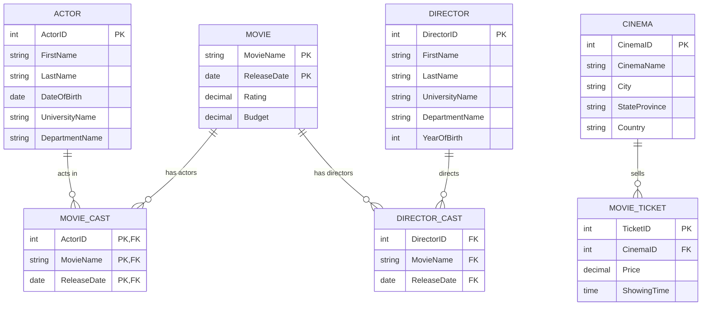

# 🎬 Movie Database — SQL, PostgreSQL, Python & XQuery

## 📌 Project Overview

This project is about building and working with a movie database using **PostgreSQL**. The database contains information about movies, actors, directors, cinemas, movie casts, and movie tickets.

I worked on this project to improve my practical skills in **SQL, database design, Python, data analysis, and XML/XQuery**. I created relationships between different tables, wrote SQL queries to find and analyze data, and used Python to connect to the database and work with the results.

The project also includes working with XML data to understand how semi-structured data can be stored and queried.

---

## 🗂️ Database Structure

The database includes the following tables:

* **Actor** — Stores actor information such as name, date of birth, and education.
* **Movie** — Stores movie names, release dates, ratings, and budgets.
* **Director** — Stores director information and education details.
* **Cinema** — Stores cinema names and location information.
* **MovieCast** — Connects actors with the movies they appear in.
* **DirectorCast** — Connects directors with the movies they direct.
* **MovieTicket** — Stores ticket information such as price, cinema, and showing time.

### Entity Relationship Diagram



---

## 📋 Table Details

| Table            | Description                                                     |
| ---------------- | --------------------------------------------------------------- |
| **Actor**        | Stores actor information, date of birth, and education details. |
| **Movie**        | Stores movie names, release dates, ratings, and budgets.        |
| **Director**     | Stores director information and education details.              |
| **Cinema**       | Stores cinema names and location details.                       |
| **MovieCast**    | Connects actors with the movies they appear in.                 |
| **DirectorCast** | Connects directors with their movies.                           |
| **MovieTicket**  | Stores ticket price, cinema, and showing time.                  |

---

## 🛠️ Technologies Used

* PostgreSQL
* SQL
* Python
* Pandas
* Psycopg2
* XML
* XQuery
* pgAdmin 4
* Git & GitHub

---

# 1. 🗄️ Database Design

I designed the database using a relational model with **primary keys and foreign keys** to connect the different tables.

For example, an actor can be part of many movies, and a movie can have many actors. The `MovieCast` table is used to manage this many-to-many relationship.

Similarly, the `DirectorCast` table connects directors with the movies they direct.

This design helps keep the data organized and avoids storing the same information in multiple places.

---

# 2. 🔎 SQL Queries & Data Analysis

I wrote different SQL queries to filter, join, and analyze the data in the database.

## Filter Directors by Country

This query finds directors who are from Canada:

```sql
SELECT 
    "Director"."FirstName" AS "First_Name",
    "Director"."LastName" AS "Last_Name"
FROM "Director"
WHERE "Director"."Country" = 'Canada';
```

This query helped me practice:

* `SELECT`
* `WHERE`
* Column aliases
* Filtering data

---

## 🔗 Joining Tables & Currency Conversion

This query joins the `Movie`, `MovieCast`, and `Actor` tables. It finds movies with a budget of at least 1.5 million and calculates the budget in different currencies.

```sql
SELECT 
    "Movie"."MovieName",
    "Actor"."FirstName",
    "Actor"."LastName",
    "Movie"."Budget" AS "Budget_in_USD",
    "Movie"."Budget" * 1.35 AS "Budget_in_CAD",
    "Movie"."Budget" * 138.82 AS "Budget_in_JPY",
    "Movie"."Budget" * 60.55 AS "Budget_in_RUB",
    "Movie"."Budget" * 0.96 AS "Budget_in_EUR",
    "Movie"."Budget" * 0.94 AS "Budget_in_CHF"
FROM "Movie"
JOIN "MovieCast"
    ON "Movie"."MovieName" = "MovieCast"."MovieName"
    AND "Movie"."ReleaseDate" = "MovieCast"."ReleaseDate"
JOIN "Actor"
    ON "MovieCast"."ActorID" = "Actor"."ActorID"
WHERE "Movie"."Budget" >= 1500000;
```

This helped me practice:

* SQL joins
* Foreign key relationships
* Filtering
* Calculated columns
* Basic data transformation

> The exchange rates used in this query are fixed values for the purpose of the project.

---

## 📊 Movie Budget Analysis

I also used aggregate functions to find the minimum, average, and maximum movie budgets.

```sql
SELECT 
    MIN("Budget") AS "Minimum_Budget",
    AVG("Budget") AS "Average_Budget",
    MAX("Budget") AS "Maximum_Budget"
FROM "Movie";
```

### Average Actor Age

```sql
SELECT 
    AVG(2022 - EXTRACT(YEAR FROM "DateOfBirth")) AS "Average_Age"
FROM "Actor";
```

These queries helped me practice:

* `MIN()`
* `AVG()`
* `MAX()`
* Date calculations
* Aggregate functions

---

# 3. 🐍 Python & PostgreSQL

I used **Python** to connect to PostgreSQL, run SQL queries, and work with the results using **Pandas**.

For example, I used Python to get the average age of actors from the database and store the result in a Pandas DataFrame.

```python
import os
import psycopg2
import pandas as pd

connection = psycopg2.connect(
    host="localhost",
    database="lab05",
    port=5433,
    user="postgres",
    password=os.getenv("DB_PASSWORD")
)

cursor = connection.cursor()

cursor.execute("""
    SELECT AVG(2022 - EXTRACT(YEAR FROM "DateOfBirth"))
    FROM "Actor";
""")

result = cursor.fetchall()

df = pd.DataFrame(result, columns=["Average Age"])

print(df)

cursor.close()
connection.close()
```

This gave me experience with:

* Connecting Python to PostgreSQL
* Running SQL from Python
* Retrieving database results
* Creating Pandas DataFrames
* Basic ETL processes

---

# 4. ➕ Adding Data with Python

I also used Python to insert new records into the database.

```python
import os
import psycopg2

connection = psycopg2.connect(
    host="localhost",
    database="lab05",
    port=5433,
    user="postgres",
    password=os.getenv("DB_PASSWORD")
)

cursor = connection.cursor()

query = '''
    INSERT INTO "Genre" ("Type", "Description")
    VALUES (%s, %s);
'''

values = ("Action", "Fighting movie")

cursor.execute(query, values)

connection.commit()

print(cursor.rowcount, "record(s) inserted.")

cursor.close()
connection.close()
```

I used **parameterized queries** when inserting data. This is a safer way to work with user-provided or changing values and helps reduce the risk of SQL injection.

---

# 5. 📄 XML & XQuery

The project also includes an example of working with **semi-structured data** using XML and XQuery.

## Sample XML

```xml
<MOVIES>
    <MOVIE>
        <Title>Spiderman3</Title>
        <Year_of_production>2017</Year_of_production>
        <budget>2000000</budget>
        <director>sam raimi</director>
        <rating>9.7</rating>
        <duration>139 minutes</duration>

        <actor>
            <name>tobey maguire</name>
            <age>47</age>
            <country>USA</country>
        </actor>
    </MOVIE>
</MOVIES>
```

Unlike a relational database, XML stores information in a hierarchical structure.

---

## 🔍 XQuery

The following query finds actors who are younger than 35 and sorts them by age.

```xquery
xquery version "3.0";

for $actor in MOVIES/MOVIE/actor
where $actor/age < 35
order by $actor/age
return $actor
```

This gave me experience with:

* XML data
* XQuery
* Filtering XML elements
* Sorting data
* FLWOR expressions

---

# ⚙️ Requirements

To run this project, you will need:

* PostgreSQL 10+
* pgAdmin 4
* Python 3.x
* Git

### Python Libraries

```bash
pip install psycopg2-binary pandas
```

---

# 🚀 How to Run

### 1. Clone the Repository

```bash
git clone https://github.com/yourusername/movie-database.git
cd movie-database
```

### 2. Set Up PostgreSQL

Create the database and run the SQL scripts included in the repository.

### 3. Install Python Libraries

```bash
pip install -r requirements.txt
```

### 4. Configure Database Password

I recommend using an environment variable instead of putting your database password directly in the Python code.

**Windows PowerShell:**

```powershell
$env:DB_PASSWORD="your_password"
```

**macOS/Linux:**

```bash
export DB_PASSWORD="your_password"
```

### 5. Run the Python Script

```bash
python python/data_analysis.py
```

---

# 📁 Project Structure

```text
movie-database/
│
├── README.md
│
├── sql/
│   ├── schema.sql
│   ├── queries.sql
│   └── insert_data.sql
│
├── python/
│   ├── database_connection.py
│   ├── data_analysis.py
│   └── insert_records.py
│
├── xml/
│   ├── movies.xml
│   └── queries.xq
│
├── requirements.txt
│
└── .gitignore
```

---

# 🔐 Security

Never upload database passwords or other sensitive information to GitHub.

For example, instead of writing:

```python
password="mypassword"
```

use:

```python
password=os.getenv("DB_PASSWORD")
```

Also add `.env` to your `.gitignore` file if you use one.

```text
.env
__pycache__/
*.pyc
```

---

# 💡 Skills I Practiced

Through this project, I gained hands-on practice with:

* SQL
* PostgreSQL
* Relational database design
* ER diagrams
* Primary and foreign keys
* SQL joins
* Data filtering
* Aggregate functions
* Data calculations
* Python
* Pandas
* Psycopg2
* ETL
* XML
* XQuery
* Data transformation
* Git and GitHub

---

# 🎯 What I Learned

This project helped me understand how databases are designed and how SQL can be used to work with real data. I also learned how to connect a PostgreSQL database with Python and use Pandas to work with the data.

Working with XML and XQuery also gave me experience with a different type of data structure outside of traditional relational databases.

Overall, this project helped me build a stronger foundation in **SQL, databases, Python, and data analysis**, which I can apply to entry-level **Data Analyst and Data Analytics** roles.

---

## 👤 About Me

**Mohammad**
BSc Computer Science — Data Science Specialization

**Skills:** SQL • Python • R • Excel • Tableau • Power BI • PostgreSQL • Pandas

I am currently looking for **entry-level Data Analyst and Data Analytics opportunities** where I can apply my skills, learn from an experienced team, and grow as a data professional.
