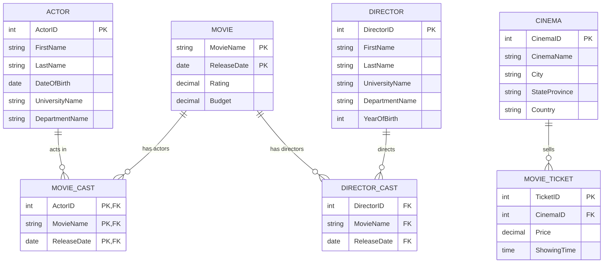

# 🎬 Movie Database — SQL, PostgreSQL, Python & XQuery

## 📌 Project Overview

This project focuses on designing and working with a relational movie database using **PostgreSQL**. The database stores information about movies, actors, directors, cinemas, movie casts, and movie tickets.

The project demonstrates practical skills in **relational database design, SQL querying, data analysis, Python database integration, ETL, and semi-structured data processing using XML and XQuery**.

The main goal was to build a structured database and use SQL and Python to extract meaningful information, perform calculations, manipulate data, and work with different data formats.

---

## 🗂️ Database Structure

The database consists of the following main entities:

* **Actor** — Contains actor information, including name, date of birth, and educational background.
* **Movie** — Stores movie names, release dates, ratings, and budgets.
* **Director** — Contains director information and educational background.
* **Cinema** — Stores cinema names and geographical information.
* **MovieCast** — Maps actors to movies through a many-to-many relationship.
* **DirectorCast** — Associates directors with their respective movies.
* **MovieTicket** — Stores ticket information, including price, cinema, and showing time.

### Entity Relationship Diagram



---

## 📋 Table Details

| Table            | Description                                                               |
| ---------------- | ------------------------------------------------------------------------- |
| **Actor**        | Contains personal information, date of birth, and educational background. |
| **Movie**        | Stores movie records, release dates, ratings, and budgets.                |
| **Director**     | Contains director information and educational background.                 |
| **Cinema**       | Stores cinema names and location information.                             |
| **MovieCast**    | Represents the many-to-many relationship between actors and movies.       |
| **DirectorCast** | Maps directors to their respective movie projects.                        |
| **MovieTicket**  | Tracks ticket information, including price, cinema, and showing time.     |

---

# 🛠️ Technologies Used

* **PostgreSQL**
* **SQL**
* **Python**
* **Pandas**
* **Psycopg2**
* **XML**
* **XQuery**
* **pgAdmin 4**
* **Git & GitHub**

---

# 1. 🗄️ Relational Database Design

The database was designed using a relational model with primary keys and foreign keys to maintain relationships between tables.

### Key Relationships

* One **Actor** can appear in multiple movies.
* One **Movie** can contain multiple actors.
* One **Director** can direct multiple movies.
* A **Cinema** can sell multiple movie tickets.
* `MovieCast` handles the many-to-many relationship between actors and movies.
* `DirectorCast` connects directors with movies.

This structure helps reduce data duplication while maintaining data integrity through relational constraints.

---

# 2. 🔎 SQL Queries & Data Analysis

Several SQL queries were written to retrieve, filter, join, and analyze information stored in the database.

## Filter Directors by Country

This query retrieves directors from Canada.

```sql
SELECT 
    "Director"."FirstName" AS "First_Name",
    "Director"."LastName" AS "Last_Name"
FROM "Director"
WHERE "Director"."Country" = 'Canada';
```

### What it demonstrates

* `SELECT`
* Column aliases
* `WHERE` filtering
* Retrieving specific records based on conditions

---

## 🔗 Join Tables & Multi-Currency Calculation

This query joins the `Movie`, `MovieCast`, and `Actor` tables to identify actors associated with higher-budget movies.

It also converts movie budgets from USD into several currencies.

```sql
SELECT 
    "Movie"."MovieName",
    "Actor"."FirstName",
    "Actor"."LastName",
    "Movie"."Budget" AS "Budget_in_USD",
    "Movie"."Budget" * 1.35 AS "Budget_in_CAD",
    "Movie"."Budget" * 138.82 AS "Budget_in_JPY",
    "Movie"."Budget" * 60.55 AS "Budget_in_RUB",
    "Movie"."Budget" * 0.96 AS "Budget_in_EUR",
    "Movie"."Budget" * 0.94 AS "Budget_in_CHF"
FROM "Movie"
JOIN "MovieCast"
    ON "Movie"."MovieName" = "MovieCast"."MovieName"
    AND "Movie"."ReleaseDate" = "MovieCast"."ReleaseDate"
JOIN "Actor"
    ON "MovieCast"."ActorID" = "Actor"."ActorID"
WHERE "Movie"."Budget" >= 1500000;
```

### What it demonstrates

* Multi-table joins
* Foreign key relationships
* Filtering with conditions
* Calculated columns
* Currency conversion
* Data transformation using SQL

---

## 📊 Aggregations & Average Age Calculation

### Movie Budget Statistics

Calculates the minimum, average, and maximum movie budgets.

```sql
SELECT 
    MIN("Budget") AS "Minimum_Budget",
    AVG("Budget") AS "Average_Budget",
    MAX("Budget") AS "Maximum_Budget"
FROM "Movie";
```

### Average Actor Age

Calculates the average age of actors based on their date of birth.

```sql
SELECT 
    AVG(2022 - EXTRACT(YEAR FROM "DateOfBirth")) AS "Average_Age"
FROM "Actor";
```

### What it demonstrates

* `MIN()`
* `AVG()`
* `MAX()`
* Date extraction
* Aggregate calculations

---

# 3. 🐍 Python Database Integration & ETL

Python was used to connect to PostgreSQL, execute SQL queries, retrieve results, and process the data using **Pandas**.

The project uses the `psycopg2` library to establish the PostgreSQL connection.

## Extract Data into Pandas

The following example retrieves the average actor age from PostgreSQL and stores the result in a Pandas DataFrame.

> **Security note:** Database passwords should never be hard-coded in a public GitHub repository. Use environment variables instead.

```python
import os
import psycopg2
import pandas as pd

connection = psycopg2.connect(
    host="localhost",
    database="lab05",
    port=5433,
    user="postgres",
    password=os.getenv("DB_PASSWORD")
)

cursor = connection.cursor()

cursor.execute("""
    SELECT AVG(2022 - EXTRACT(YEAR FROM "DateOfBirth"))
    FROM "Actor";
""")

result = cursor.fetchall()

df = pd.DataFrame(result, columns=["Average Age"])

print(df)

cursor.close()
connection.close()
```

### What it demonstrates

* Python-to-PostgreSQL connectivity
* SQL execution through Python
* Extracting database results
* Pandas DataFrame creation
* Basic ETL workflow

---

# 4. ➕ Insert Records Using Python

Python was also used to insert new records into the database using parameterized SQL queries.

```python
import os
import psycopg2

connection = psycopg2.connect(
    host="localhost",
    database="lab05",
    port=5433,
    user="postgres",
    password=os.getenv("DB_PASSWORD")
)

cursor = connection.cursor()

query = '''
    INSERT INTO "Genre" ("Type", "Description")
    VALUES (%s, %s);
'''

values = ("Action", "Fighting movie")

cursor.execute(query, values)

connection.commit()

print(cursor.rowcount, "record(s) inserted.")

cursor.close()
connection.close()
```

### Why parameterized queries?

Parameterized queries help prevent SQL injection and provide a safer way to insert dynamic values into a database.

---

# 5. 📄 Semi-Structured Data — XML & XQuery

In addition to relational data, the project explores **semi-structured data** using XML and XQuery.

## Sample XML Document

```xml
<MOVIES>
    <MOVIE>
        <Title>Spiderman3</Title>
        <Year_of_production>2017</Year_of_production>
        <budget>2000000</budget>
        <director>sam raimi</director>
        <rating>9.7</rating>
        <duration>139 minutes</duration>

        <actor>
            <name>tobey maguire</name>
            <age>47</age>
            <country>USA</country>
        </actor>
    </MOVIE>
</MOVIES>
```

The XML document represents movie information using a hierarchical structure rather than relational tables.

---

## 🔍 XQuery

The following XQuery retrieves actors younger than 35 and sorts them by age.

```xquery
xquery version "3.0";

for $actor in MOVIES/MOVIE/actor
where $actor/age < 35
order by $actor/age
return $actor
```

### What it demonstrates

* XML navigation
* Filtering XML elements
* `FLWOR` expressions
* Conditional filtering
* Sorting XML data

---

# 6. ⚙️ Requirements & Setup

## Software Requirements

* PostgreSQL 10+
* pgAdmin 4
* Python 3.x
* Git
* GitHub

## Python Libraries

Install the required Python packages with:

```bash
pip install psycopg2-binary pandas
```

---

# 🚀 Getting Started

## 1. Clone the Repository

```bash
git clone https://github.com/yourusername/movie-database.git
cd movie-database
```

## 2. Create the PostgreSQL Database

Create a PostgreSQL database and configure the required tables using the SQL scripts included in the repository.

## 3. Configure Database Credentials

Instead of storing credentials directly in Python, set an environment variable.

### Windows PowerShell

```powershell
$env:DB_PASSWORD="your_password"
```

### macOS / Linux

```bash
export DB_PASSWORD="your_password"
```

## 4. Install Dependencies

```bash
pip install -r requirements.txt
```

Example `requirements.txt`:

```text
psycopg2-binary
pandas
```

## 5. Run the Python Scripts

```bash
python scripts/database_analysis.py
```

---

# 📁 Project Structure

```text
movie-database/
│
├── README.md
│
├── sql/
│   ├── schema.sql
│   ├── queries.sql
│   └── insert_data.sql
│
├── python/
│   ├── database_connection.py
│   ├── data_analysis.py
│   └── insert_records.py
│
├── xml/
│   ├── movies.xml
│   └── queries.xq
│
├── requirements.txt
│
└── .gitignore
```

---

# 🔐 Security

Sensitive database credentials should **never** be committed to GitHub.

Use environment variables or a `.env` file instead.

Example:

```text
DB_HOST=localhost
DB_PORT=5433
DB_NAME=lab05
DB_USER=postgres
DB_PASSWORD=your_password
```

Add `.env` to `.gitignore`:

```text
.env
__pycache__/
*.pyc
```

---

# 💡 Key Skills Demonstrated

Through this project, I developed practical experience with:

* Relational database design
* Entity Relationship Diagrams
* Primary and foreign keys
* SQL querying
* Filtering and sorting
* Multi-table joins
* Aggregate functions
* Data calculations and transformations
* PostgreSQL
* Python database connectivity
* Pandas
* ETL concepts
* Parameterized SQL queries
* XML data structures
* XQuery and FLWOR expressions
* Data security and credential management
* Git and GitHub

---

# 🎯 Project Objective

The project demonstrates how structured and semi-structured data can be stored, queried, transformed, and analyzed using different technologies.


📌 Interested in **Entry-Level Data Analyst and Data Analytics opportunities**.
