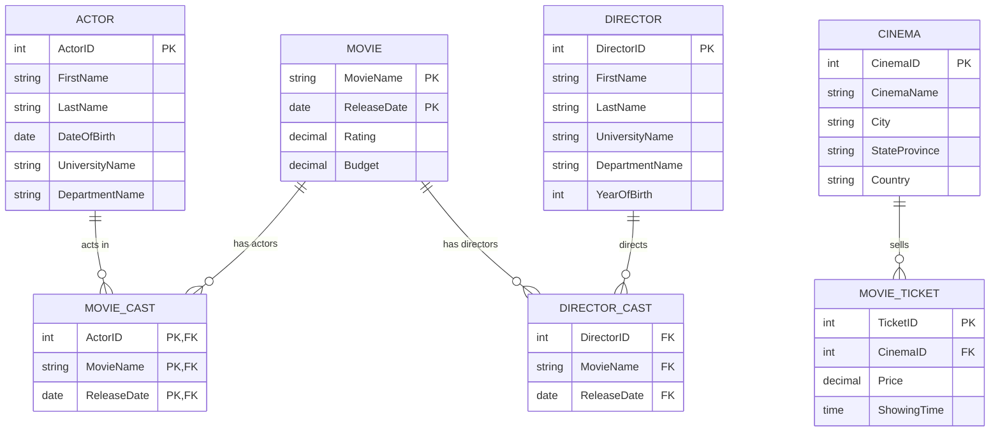

Movie & Academic Database System Implementation

This repository contains my complete database coursework and lab implementations. It covers initial database conceptual design with ER/UML diagrams, table creation in PostgreSQL, detailed SQL querying, Python integration for data extraction, and XML/XQuery processing for semi-structured data.

Project Overview & ER Diagram

The overall system architecture models two main domain areas: academic structure (Faculties, Students, Departments, Courses) and a media management network (Movies, Directors, Actors, Cinemas, and Tickets).

1. Project Overview & ER Diagram

The overall system architecture models two main domain areas: academic structure (Faculties, Students, Departments, Courses) and a media management network (Movies, Directors, Actors, Cinemas, and Tickets).

2. Database Schema & Tables Setup

The relational model was implemented in PostgreSQL (lab05 database). Below are the main tables along with their primary key (PK) and foreign key (FK) setups:

The database uses primary and foreign keys to establish relationships between entities and supports tracking movie releases, cast members, directors, cinema locations, ticket prices, and showing times.
